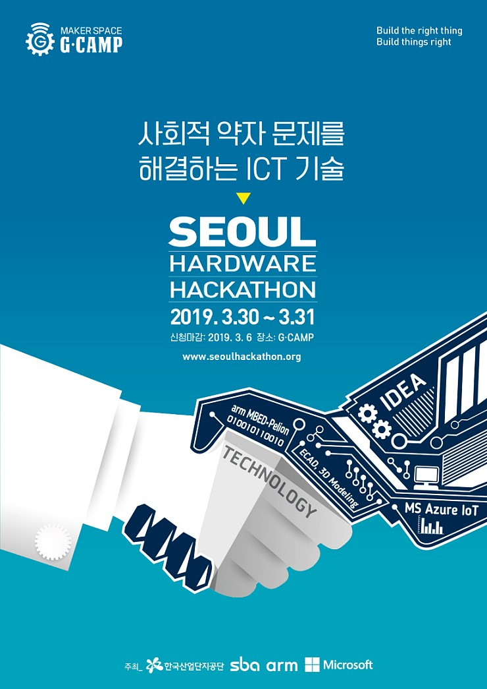

## iTurtleAlpha
2019년도 서울해커톤 참여 프로젝트

## OverView
독거노인이나, 집안에서만 활동할 수 밖에 없는 사회적 약자를 위한 돌보미 로봇 제작
iturtle.mp4

## Contributors
- 최규남 / robertchoi / Leader
- 크리스천 / christian / Designer / christian.piponides@gmail.com
- 김진성 / Soft programmer / jinny42@hanmail.net
- 설윤호 / 단국대 기계 Hardware / syh9594@gmail.com
- 변규영 / Hardware / ceo@steammaker.co.kr
- 성규현 / Soft programmer / hyunskyu@gmail.com
- 정강빈 / Hardware / bigdefence@naver.com
- 김세진 / Online programmer / dev.napier@gmail.com

## Contributing, feedback, contact
Any kind of feedback/criticism would be greatly appreciated (software design, documentation, improvement ideas, spelling mistakes, etc...).
If you'd like to see some features or algorithms implemented in iTurtleAlpha, please let us know!
Please feel free to contribute (see guidelines) and send pull requests!
For bugs, issues or questions about iTurtleAlpha, you can use the GitHub project page (please don't send me emails as there would be no record for other users).
